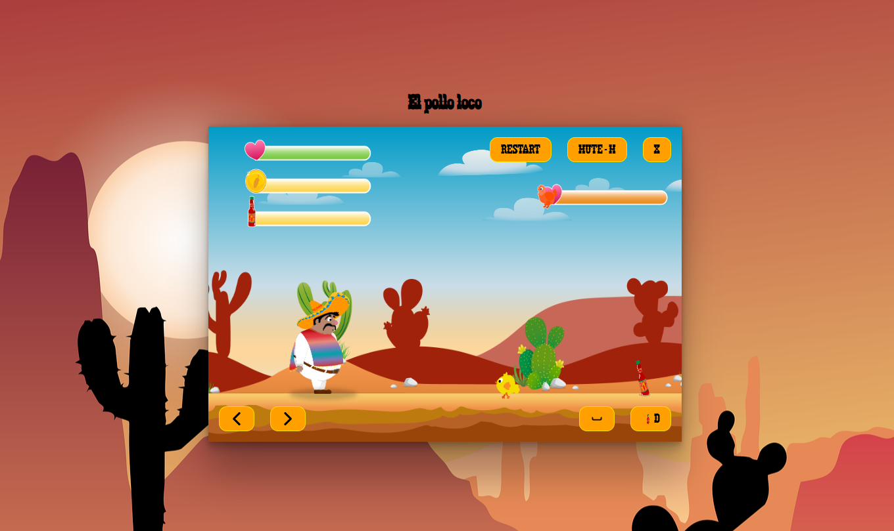

# 🕹️ 2D Jump-and-Run Game

A fun and engaging 2D jump-and-run game inspired by classics like **Super Mario**. Control **Pepe**, navigate through obstacles, collect items, and defeat the final boss to win the game!

---

## 📖 About the Project

This project is a jump-and-run game built with **object-oriented programming (OOP)** principles. The game features smooth character movements, collision detection, interactive environments, and a challenging final boss.

---

## 🛠️ Technologies Used

- **JavaScript**: For game logic and interactivity.
- **HTML**: For structuring the game canvas.
- **CSS**: For styling and visual design.

---

## 🚀 Features

- **Dynamic Gameplay**:
  - Control the character to jump, collect coins, and avoid enemies.
  - Fight a challenging final boss to complete the game.
  
- **Collision Detection**:
  - Real-time collision detection for interactive gameplay.

- **Object-Oriented Programming**:
  - Modular and class-based architecture for reusable and maintainable code.

- **Responsive Design**:
  - Fully responsive game that runs smoothly in the browser.

---

## 🌐 Live Demo

- **Play the Game**: [Live Test](http://pollo-loco.vadim-wart.com/)  
- **GitHub Repository**: [GitHub Link](https://github.com/VadimWart/El-Pollo-Loco.git/)

---

## 📚 What I Learned

- **Object-Oriented Programming**:
  - Designing and implementing classes for game objects such as the player, enemies, and items.
  - Leveraging inheritance and encapsulation for better code structure.

- **Game Development**:
  - Implementing features like:
    - Real-time collision detection.
    - Character animation and movement.
    - Smooth transitions between game states.

- **Browser-Based Deployment**:
  - Hosting a playable game on the web.

---

## 🌟 Screenshots

### Game Screenshot

